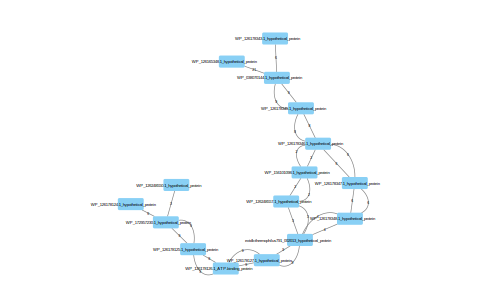
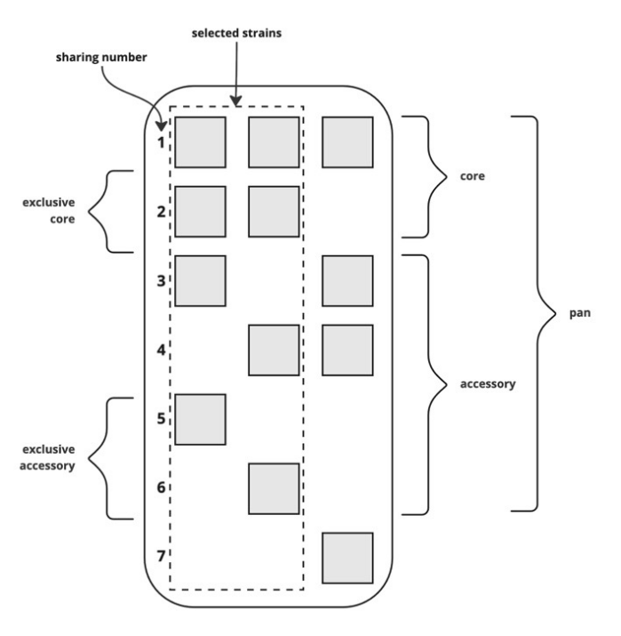
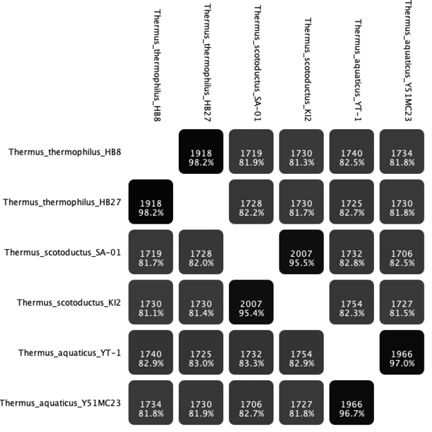

### Abstract

**Background**: Pan-genomic analysis allows for a more comprehensive understanding of the genetic diversity within a species, as well as the identification of unique genomic features that contribute to phenotypic traits and evolutionary adaptation. Pan-genomics software development has been driven by the increasing availability of genome sequencing data, as well as the need to analyze and compare large-scale genomic datasets efficiently. These tools are essential for various applications, including microbial genomics, comparative genomics, evolutionary studies, and genome-wide association studies.

**Results**: We present Geneset, a desktop application written in Java providing algorithms and advanced visualization for comparative and pan-genomics. It analyses synteny and structural patterns using pan-genome graphs. The software is built upon Apache Spark cloud computing environment and is scalable as such. Geneset uses a suite of external open source command line tools.

**Conclusions**: Although possible to be run in a headless mode as part of a workflow/pipeline or as a database accessible from a Spark context, the Geneset software suite offers a rich UI and unprecedented graphics capabilities, such as visualization of synteny using colors, genome atlases and phylogeny comparisons. The program offers automatic reordering of contigs. The interactive mode manual curation of results easier. We show that the difference in genomic features in Thermus are responsible for divergence and different adaptations.

**Keywords**: pangenomics, microbial genomics, whole genome sequencing, bioinformatics

+++

### Background

A single genome does not represent the full range of genetic diversity within a species, as it only provides information about one individual or strain. In contrast, pan-genomics can identify and analyze genetic variations across multiple strains, revealing insights into the genomic diversity and evolutionary history of a population.

Additionally, pan-genomics allows for the identification of accessory genes, which are not present in all individuals of a species but may contribute to virulence, antibiotic resistance, and other phenotypic traits. These genes may be missed in the analysis of a single genome but can be identified through pan-genomics software.
This information can provide insights into the origin, migration, and diversification of a species.
Here we describe Geneset, a software suite for pangenomics analysis. By using the Apache Spark cloud computing software as a basis the processes can be easily scaled and run in the cloud. Most cloud venders offer Spark as a cloud computing runtime. Spark also gives access to a wealth of highly optimized algorithms with a standard usage pattern. The main concept in Geneset is the Set. Homologous genes or groups of homologous clusters, their intersections and unions represent the core, accessory, shell and cloud genomes.

Visualization is an essential component of science as it allows researchers to communicate complex data and concepts in a clear and accessible manner. Visualization tools and techniques enable scientists to analyze, interpret, and communicate their findings effectively, enhancing scientific understanding and discovery. Visualization tools can help scientists to discover patterns, relationships, and correlations that may be difficult to identify from raw data. Interactive visualizations can enable researchers to manipulate and explore data in new ways, uncovering hidden trends and patterns that may lead to new insights and discoveries.

+++

### Implementation

Geneset takes as an input a project directory or zip file containing genbank files and/or fasta genome sequence files. After running a series of preprocessing steps, 4 result tables produced. These are the Annotation, GeneGroup, Islands and Functions tables and are SQL queriable and accessible via any tool supporting JDBC connections. All subsequent result and metadata files are saved to the project directory/zip file. A DataSource for genbank ('gbk') files was created for Apache Spark and the software can be loaded into existing Spark environment as a library.

Geneset can automatically search for and fetch annotated bacterial genomes from the NCBI (.gbff files). In addition to publicly available strains the user can include assembled fasta files from novel strains. These can optionally be run through the PGAP annotation pipeline if installed on the same machine. The genbank result files are compressed into a single zip archive or a directory constituting to a project in Geneset. Geneset uses the zip format for all input files, associated metadata and derived data from calculation and image generation. Hence, a zip file is a single project in Geneset containing all the genomes and metadata produced by the software. Geneset loads the genes and CDS's from all the genbank files into a main gene set table. If PGAP is not used for annotation, Prodigal is used to identify the genes on the sequence contigs from fasta files of sequence contigs.

Central to Geneset is gene set concept. A gene set can be a group of homologous genes or a island/cassette of genes in a region. Describing the functionality of the software we will use a example project of 100 strains from the bacterial genus Thermus along with smaller separate a Thermus phage project. After importing genome data into the project and doing preliminary annotations a few preprocessing steps need to be run. Additional annotation can be run after the preprocessing.

#### Preprocessing
Geneset requires four data preparation steps before the genomes can be compared, analysed and vizualized. The steps are 1. Gene clustering, 2. Multiple Sequence Alignment (MSA), 3. Synteny analysis and island identification and 4. Phylogeny. The four tasks depend on third party software such as [Blast/Diamond](https://doi.org/10.1038/s41592-021-01101-x), [MAFFT](https://doi.org/10.1093/nar/gkf436) and [FastTree](https://doi.org/10.1371/journal.pone.0009490). Apache Spark is used to parallelize the preprocessing tasks.

#### Gene clustering
To prepare for comparative analysis of the genomes in the project, the first step is to run the "Group genes" pipeline. This task translates to a Spark map/reduce process that uses NCBI blast or diamond (with a blast compatible output) to join homolog genes. A blast/diamond protein database with all the genes in the project is created. A Spark dataset of protein fasta entries is generated for each gene. The unique gene id from the genbank files is used to identify the genes. By default, each species or a contig is a single partition in the Spark gene dataset but the user can change the number of partitions depending on the size of the data and compute cluster. The default criteria for joining two genes is the 50/50 rule. That means, at least 50% of the gene length must have 50% identity with the comparing sequence. For metagenomic analysis or viral genomes a less stringent values might be suitable, such as 25/50. A map step on the gene spark datasets maps each fasta entry to a group of gene ids from the blast/diamond run. The final reduce step joins all the groups that have common entries. The result is saved into the project zip file as a text file containing comma separated list of all gene ids in a group per line. This step is computationally expensive compared to other clustering approaches in pan genomes, such as MCL. Doing an all against all blast is much more accurate though and within the scope of bacterial analysis, especially when using cloud computing environments such as Apache Spark.

#### MSA
The main Geneset table has now been reduced (from around 200000 gene entries to 8500 gene families in a project using 100 Thermus strains). Each row now represents a set of homologus genes. The next step is to run multiple sequence alignment (MSA) on all the groups. For this we use the [MAFFT](https://doi.org/10.1093/nar/gkf436) multiple alignment software. Again a Spark dataset is created, now with all the protein sequences in a group. The map step produces a fasta format that is fed into the [MAFFT](https://doi.org/10.1093/nar/gkf436) algorithm. The resulting MSA fasta is saved into the project zip file (under the 'alignment' folder). Optional: HMMER Sequence profiles can be generated from all the gene groups if the user wants to use profile queries against the project data. The HMMER files are stored in the 'hmmer' folder.

#### Synteny cluster detection
Synteny in biology refers to the conservation of gene order and arrangement across different species or within a species. There are several reasons for the existence of synteny in biology:

*Evolutionary Conservation*: Synteny is often the result of evolutionary processes that conserve the organization of genes over time. It indicates that certain gene arrangements have been advantageous and maintained through natural selection because they contribute to the fitness or survival of the organism.

*Functional Relationships*: Synteny can reflect functional relationships between genes. Genes located close to each other on a chromosome may have co-evolved and become functionally linked. This can occur when genes participate in the same biological pathway or are involved in coordinating specific cellular processes.

*Gene Regulation*: Synteny can play a role in gene regulation. Regulatory elements that control gene expression, such as enhancers or silencers, may be located in close proximity to the genes they regulate. By maintaining synteny, the regulatory elements can be conserved along with the genes, ensuring proper gene expression patterns.

*Chromosomal Rearrangements*: Synteny can be disrupted by chromosomal rearrangements, such as inversions, translocations, or duplications. However, the presence of synteny despite occasional rearrangements suggests that these rearrangements are relatively rare or have been counterbalanced by selection pressures, indicating the importance of maintaining gene order.

Comparative Genomics: Synteny is a valuable tool in comparative genomics. By comparing the gene order and organization across different species, researchers can infer evolutionary relationships, identify conserved regions, and gain insights into genome evolution. Synteny maps can aid in genome assembly, gene annotation, and the discovery of genetic variations associated with diseases.

Overall, the presence of synteny in biology can provide insights into the evolutionary history, functional relationships, and regulatory mechanisms of genes, and it serves as a valuable tool in comparative genomics. Each group of genes is stored as a node in a graph using Spark‘s GraphX capabilities. The edges are all possible paths to another set of genes within the project. The graph is undirected but each edge is annotated as a forward or backward edge depending on the direction of the gene. The direction annotations are only used for island identification and node collapsing. Once the genes in an islands have been joined in a single node, the graph can be treated as any other. The island identification is an iterative process. First all homologus genes with a single shared edge in the same direction are joined. Then, allowing for slight variations, four kinds of graph motifs are joined. A. replacements, B. inserts, C. flip and D. mixed. The reason for not treating every motif as D is that the motifs indicate different behavior in the genome. The images show the general pattern though the motifs can have any number of center nodes. For instance, motif A could be a single triangle.

 
*Graph motifs allowed when joining synteny breakpoints to islands*

***Automatic Split/Merge*** Matifs A and B can also indicade non-biological events such as errors in sequencing or lack of data. In the case of matif A, if the two paths have the same annotatation or the sequence similarity falls within certain threshold, the groups can be automaticaly merged. Same applies for the 'reverse' motif, if two paths collapse into a single gene group. The group is split if the calculated sequence distances allow for spliting between the two paths.

*Matif X, two paths are collapsed into a single group indicates too*

Relatively simple short motifs will produce synteny breakpoints but these four simple ones cover the majority of useful joinings. In the case of our example Thermus project the 8500 gene groups are reduced to around 7000 synteny islands. As such, the majority of the genes in a 100 strain project have fluctuating synteny. A few islands of essential genes have conserved gene order, largest of them being the 30S/50S gene island. Each island object is marked with the number of motifs of each type. This can be helpful when locating errors or specific behavior in the genome. Motif A for instance indicates an insert of gene of genes. Motif B might indicate a sequencing error where a contig is cut short and a gene doesn’t fall into its correct group, hence the split. In that case, the edge weight is low, preferably 1 strain. Otherwise motif B can show where a different family of genes are spliced into the same location in different species. Motif C is where genes or islands have swapped places in the genome order. No instance of the C motif was found in our Thermus project so it might not be a common event. The synteny graph can be exported to a .sif file readable by the Cytoscape graph visualization tool:

*An example of genome synteny graph in Cytoscape. The replacement motif (A) is part of the island as the double gene groups within the motif had been joined in previous iteration.*

+++

#### Phylogeny
FastTree algorithm is used to create phylogeny of all the multiple alignments from the MSA steps from above with more than two sequences. Phylogeny of islands are generated by cancatenating aligned sequences from the groups within the island. The results are stored in .tre files in the project directory/zip file under the 'phylogeny' folder.

+++

#### Additional annotation
Geneset does functional annotation of all the genes using eggNOG. This process is also split into Spark tasks equal to the number of species by default. Geneset selectes the most abundant annotation from each group as long as it is not marked hypothetical gene. As hmmer profiles have been generated in the previous preprocessing step, the hmmer feature in eggNOG can be used. Genes that do not fall into a known group are marked an can be run on custom annotation pipelines such as hhpred. Additional columns can be added for custom annotations. If applicable, gene islands are annotated with a functional pathway id such as kegg id.

+++

### User interface 
The procesessing and extra annotation can be run in headless mode. Geneset can be launched from the command line. Skipping arguments in the command line launches the GUI.
java -jar geneset.jar
Gene group table The main application table is the gene group table. It has three main columns, "Annotation", "Share id" and "Selection" The first column is the common annotation for the gene group. To make accumulating selections, the table has the concepts of highlighting and selecting. The user can highlight rows in the table and store selections marked in the last "selection" column. The table can be cropped based on selection allowing for creating sub-projects.

**Annotation**: The most descriptive annotation from each set of genes is used as the default annotation in the Geneset table. That is, genes with annotation 'hypothetical gene' give way for other annotations in the set.

**Sharing number**: Sharing id is given to each unique set of species/contigs. Each gene grouping is a member of one of these sets and gets that sharing id. By sorting the gene group table on the sharing id one can spot potential casettes of genes with distribution among the species in the sharing set

Set selection dialog allows the user to select rows in the Gene group table based on pan genomics of a subset of the strains in a project. According to definitions in[1], the core genome is the set of genes present in all genomes. Shell genome are genes in two or more strains and cloud genome genes found in one strains. Accessory genome is the part of the pan genome the is not in the core, the shell and cloud genomes in essence. Softcore genome has also been defined as all sets with genes present in 95% of the strains in the project. The set selection dialog allows the user to define sets of gene groups adhering to a criteria, such as the core genome of a subset of the strains in the project (e.g. the members of one species). This feature enables the user to identify differences between strains and located genetic islands. The dialog lists the strains in the project and allow the user to run on the selected stains.
Core selects all gene groups in the table that have genes in all of the selected strains. Exclusive core selects all gene groups in the table that have exclusively genes in all of the selected strains. Hence the gene group cannot contain genes from non selected strains Pan selects all gene groups in the table that have genes in at least one of the selected strains. Exclusive Pan selects all gene groups in the table that have genes in at least one of the selected strains but not in any of the non selected strains.

Pan core selection diagram

+++

The user selects all or part of the strains from the list, such as all members of a species. By using the core, pan and exclusive pan core genomes, most permutations of gene groups can be selected. For example the non-exclusive core is the core genome subtracted by the exclusive core genes.
With the Split merge dialog the user  can join or split selected rows in the Gene group table using a different criteria than used in the Gene clustering preprocessing step. Paralog genes are marked with darker color in the gene group table. Difference in the "Group coverage" and "Group size" columns can indicate paralog groups that can be split manually using the split merge dialog. A new identity value is given to make the split based on identity matrix from the MSA. Gene groups can also be manually merged if for instance a gene has been split in two because of sequencing or assembly errors.

+++

### Reporting
The Genome statistics report gives an overview of the genome size and number and types of annotations.
AAI report gives an image showing the relationship between selected strains based on Average amino acid identity. The identity is calculated on the fly from the MSA. The ordering of the strains is based on neighbour-joining clustering.

+++

AAI showing two stains from 3 different species. Strains of the same species all have similarity higher the 95%
Visualization Geneset has rich visualization features.
XYPlot Geneset is based on joining sets of annotations on a sequence, e.g. genes. Each point in the XYPlot function in geneset is based on a gene homolog, as opposed to sequence motifs from programs such as Mummer. One can rearrange contigs manualy by dragging blocks in the XY grid. The automatic rearrange function uses the gene order from a related strains to rearrange contigs in a draft sequence

+++

### Conclusion

By leveraging Spark's distributed computing framework, Geneset harnesses the power of parallel processing and handles large-scale pan-genomics data with ease. Spark's comprehensive set of libraries, such as Spark SQL, Spark MLlib, and GraphX, offer a wide range of tools for data manipulation. These libraries provide pre-built functions and algorithms that can significantly speed up the development and implementation of complex pan-genomics analyses. Also, visualization capabilities make it easier for researchers and bioinformaticians to derive meaningful insights from their data.

+++

### Availability of Source Code and Requirements

Project name: Geneset: Apache Spark based toolbox for pan genomic analysis

Project home page: https://github.com/sigmarkarl/geneset

Maven package repository: https://raw.githubusercontent.com/sigmarkarl/geneset/java11/repo

Maven coordinates: org.simmi.geneset:distann:1.0.0

Programming language: Java

Other requirements: Blast/Diamond, Mafft, fasttree, prodigal

License: MIT

+++

### Competing Interests

The authors declare that they have no competing interests

+++

### ACKNOWLEDGEMENTS

We thank everyone who has contributed to the development of Geneset through testing and feedback.